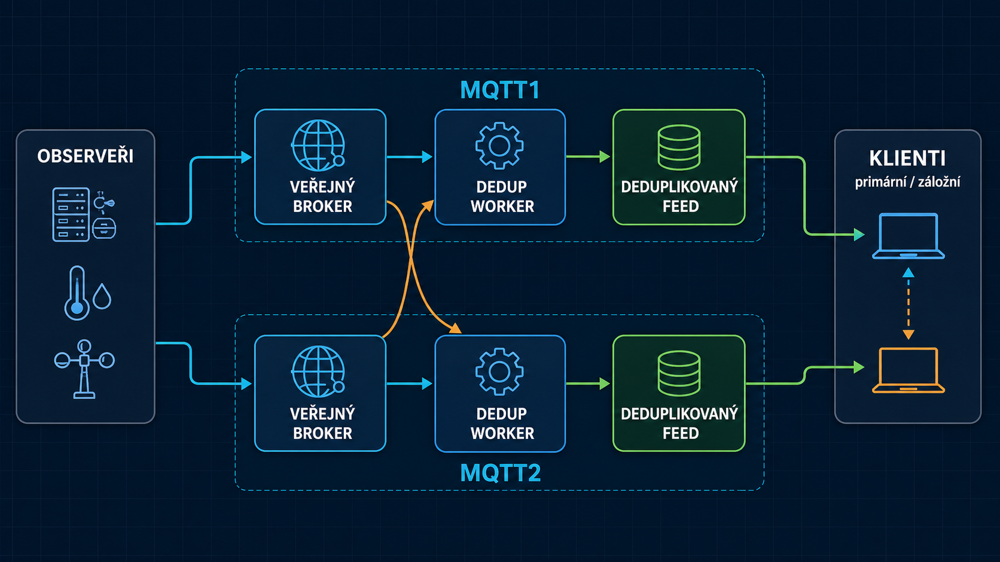

# MeshCore CZ MQTT cluster

Tento repozitář slouží k nasazení dvou nezávislých MQTT uzlů pro českou
MeshCore síť. Cílem je přijmout data observerů ze dvou míst, odstranit opakované
kopie stejných packetů a nabídnout klientům dva samostatné deduplikované feedy.

## Jak to funguje jednoduše

1. Každý observer publikuje stejná data na veřejný broker MQTT1 i MQTT2.
2. Deduplikační worker na každém uzlu čte oba veřejné brokery.
3. První kopii packetu předá do svého lokálního feedu, další kopie ve stanoveném
   časovém okně zahodí.
4. MQTT1 i MQTT2 proto vytvářejí vlastní deduplikovaný feed.
5. CoreScope, mapa nebo jiná služba mohou používat jeden feed jako primární a
   druhý jako záložní.

MQTT1 a MQTT2 nejsou jedna sdílená databáze. Každý uzel deduplikuje samostatně,
takže se jejich feedy mohou krátkodobě lišit při restartu, výpadku spojení nebo
vyprázdnění deduplikační cache. Klient nemá číst oba feedy současně, pokud neumí
odstranit duplicity ještě mezi nimi.

## Veřejný vstup a deduplikovaný feed

Na každém uzlu jsou dvě oddělené MQTT služby:

- **veřejný broker** přijímá data observerů a ověřuje jejich MeshCore token;
- **deduplikovaný feed** poskytuje již vyčištěná data read-only klientům, jako
  jsou CoreScope nebo mapa.

Observer tedy nepublikuje přímo do feedu. Aplikace pro čtení naopak nemají
přístup k interním účtům ani k monitorovacím topicům.

## MQTT1 a MQTT2

| Uzel | Veřejný vstup observerů | Deduplikovaný feed | Zveřejnění | Stav |
|---|---|---|---|---|
| MQTT1 | `wss://mqtt1-meshcore.node.cz/mqtt` | `wss://mqtt1-meshcore.node.cz/feed` | Cloudflare Tunnel | plánovaný |
| MQTT2 | `wss://mqtt2.meshcore.website/mqtt` | `wss://mqtt2.meshcore.website/feed` | Cloudflare Tunnel | v provozu |

Oba uzly jsou zveřejněné přes Cloudflare Tunnel, každý na vlastním serveru a
vlastní doméně. Každý uzel používá vlastní token audience:

- MQTT1: `mqtt1-meshcore.node.cz`
- MQTT2: `mqtt2.meshcore.website`

Token určený pro MQTT1 proto nelze použít na MQTT2 a naopak. Observer má dva
samostatné MQTT profily se stejnými topic šablonami, ale s odpovídající audience.
Podporována je WebSocket cesta `/mqtt` i kořenová cesta `/`, kterou používá
MeshCore integrace v Home Assistantu.

## Současný přechodný stav

MQTT2 je nasazený a v provozu. Protože nový MQTT1 ještě neběží, používá jeho
worker dočasně jako první zdroj existující broker `mapa.meshcore.cz`. Druhým
zdrojem je veřejný broker MQTT2.

Po nasazení MQTT1 bude cílový stav symetrický:

- worker MQTT1 bude číst veřejný broker MQTT1 i MQTT2 a zapisovat do feedu MQTT1;
- worker MQTT2 bude číst veřejný broker MQTT1 i MQTT2 a zapisovat do feedu MQTT2;
- každý uzel bude mít vlastní monitoring, data a deduplikační cache.

Přechod z dočasného zdroje na MQTT1 nevyžaduje změnu topiců v CoreScope ani v
mapě. Změní se pouze vstupní zdroj deduplikačního workeru.

## Co běží na jednom uzlu

- `public-broker` – ověřuje MeshCore tokeny a přijímá data observerů;
- `dedup-worker` – čte MQTT1 i MQTT2 a odstraňuje opakované packety;
- `feed-broker` – lokální Mosquitto s deduplikovaným feedem;
- `feed-proxy` – zachovává skutečnou IP read-only klientů;
- `monitor` – administrační dashboard a provozní agregace;
- `nginx` – veřejný HTTP/WebSocket vstup;
- `cloudflared` – na obou uzlech.

MQTT2 monitoring je dostupný na
`https://monitor-mqtt2.meshcore.website` a je chráněný Cloudflare Access.
Dashboard zobrazuje stav zdrojů, observery, veřejné IP, množství dat,
same-source a cross-source duplicity a klienty deduplikovaného feedu. Neukládá
MQTT payloady, tokeny, hesla ani privátní klíče.

## Doporučený server

Pro jeden uzel doporučujeme:

- Ubuntu Server 24.04 LTS;
- 4 GB RAM;
- 40 GB disk;
- Docker Engine a Docker Compose;
- trvalý adresář `/opt/meshcore-mqtt-stack` pro konfiguraci i data.

MQTT1 a MQTT2 mají běžet na samostatných serverech. Výpadek jednoho uzlu tak
nevyřadí druhý deduplikovaný feed.

## Bezpečnost v kostce

- Observeři používají krátkodobé tokeny podepsané vlastní MeshCore identitou.
- MQTT1 a MQTT2 mají odlišnou token audience.
- Read-only klienti feedu používají samostatné účty a mohou číst jen
  `meshcore/#`.
- Interní broker, databáze monitoru ani administrace nejsou přímo publikované
  jako Docker porty.
- Produkční hesla, tokeny, certifikáty a soubor `.env` nepatří do Git repozitáře.
- Monitor MQTT2 je přístupný jen přes samostatnou Cloudflare Access aplikaci.

## Kde pokračovat

Kompletní technický návod je v souboru
**[DEPLOYMENT.md](DEPLOYMENT.md)**. Obsahuje:

- instalaci MQTT1 a MQTT2 krok za krokem;
- konfiguraci `.env`, účtů a hesel;
- nastavení Nginxu, Cloudflare Tunnel a Cloudflare Access;
- konfiguraci observerů a read-only klientů;
- monitoring, aktualizace, diagnostiku a zálohování.
